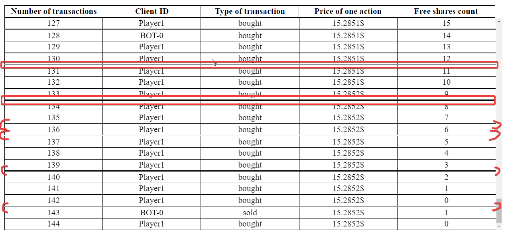

# Stock-Market-Project

## Table of Contents

- [General Info](#general-information)
- [Todos](#todos)
- [Project Status](#project-status)
- [Acknowledgements](#acknowledgements)
<!-- * [License](#license) -->

## General Information

- This project is represention of real-life stock-market prices for various items.
- Purpose of this project is to get A as final grade for web-development class.

## Todos:

- [x] Check if bot is trying to buy/sell to much of actions then it has
- [-] Sell all actions - checkbox
- [?] Store Bots data in array
- [x] If Price of action reaches 0 or lower, loop stops
- [-] If bot can't buy it needs to sell
- [-] Change from Bankrupt message to Delisted or Private - it doesn't have to bankrupt
- [x] Get random refreshrate of bots' actions
- [-] Clean code for buyActions and sellActions in Bot Class
- [-] OPTIONAL: Add some cool font
- [-] OPTIONAL: fix displaying bug 
<!--  -->
- [ ] Optional: add colors to bots name example array:
      ["322784","382888","3D2A8C","432B91","482D95","4E2E99","532F9D","5931A2","5E32A6","6433AA","6A35AE","6F36B3","7538B7","7A39BB","803ABF","853CC4","8B3DC8","903ECC","9640D0","9B41D5","A143D9","A744DD","AC45E1","B247E6","B748EA","BD49EE","C24BF2","C84CF7","CD4EFB","D34FFF"]

## Project Status

Project is: _complete_

<!-- _in progress_ / _complete_ / _no longer being worked on_. If you are no longer working on it, provide reasons why. -->

## Acknowledgements

- Idea from: Prof. Karol M.

## Contact

Created by el_pioterro.js#9419 - feel free to contact me!

<!-- Optional -->
<!-- ## License -->
<!-- This project is open source and available under the [... License](). -->

<!-- You don't have to include all sections - just the one's relevant to your project -->
